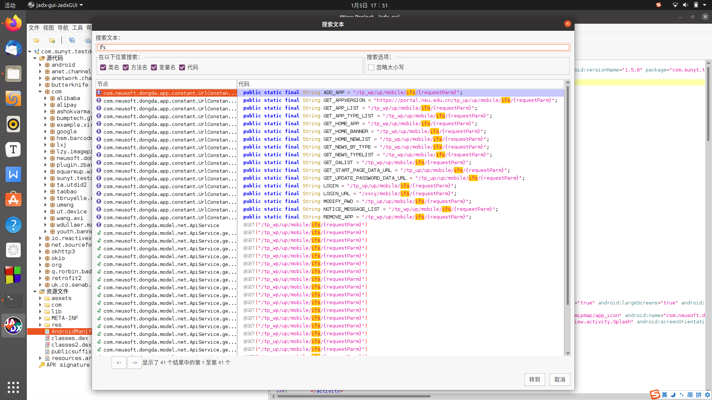
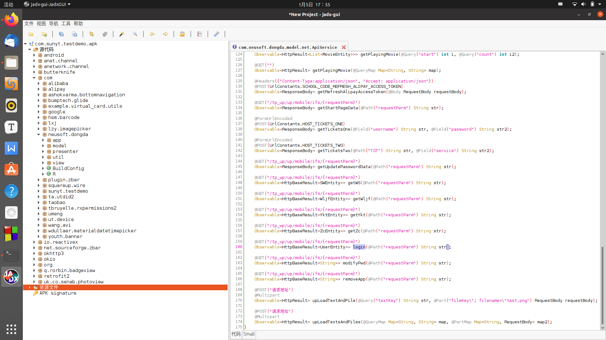
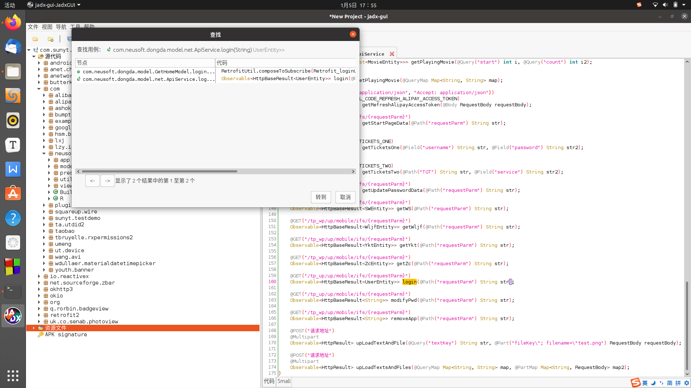
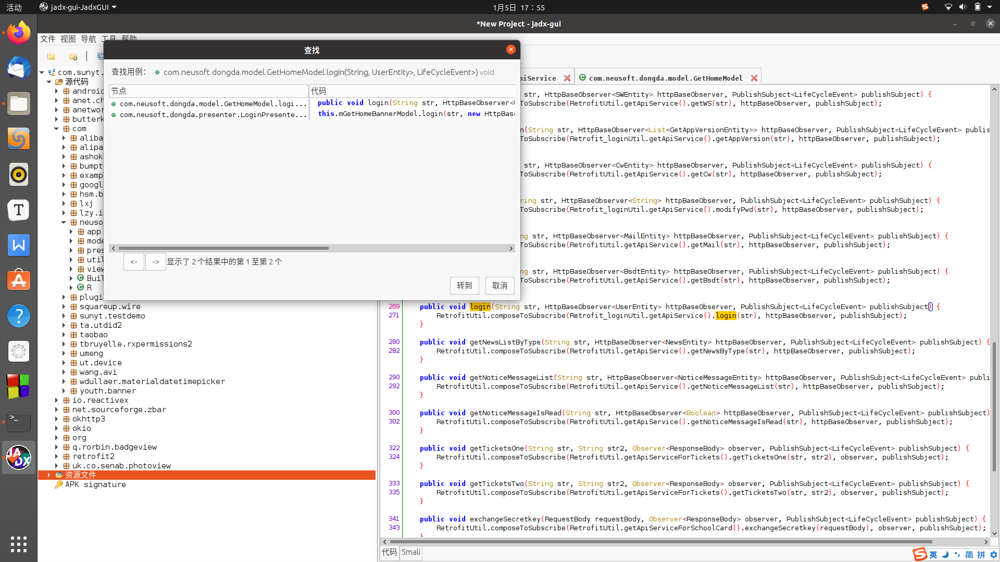
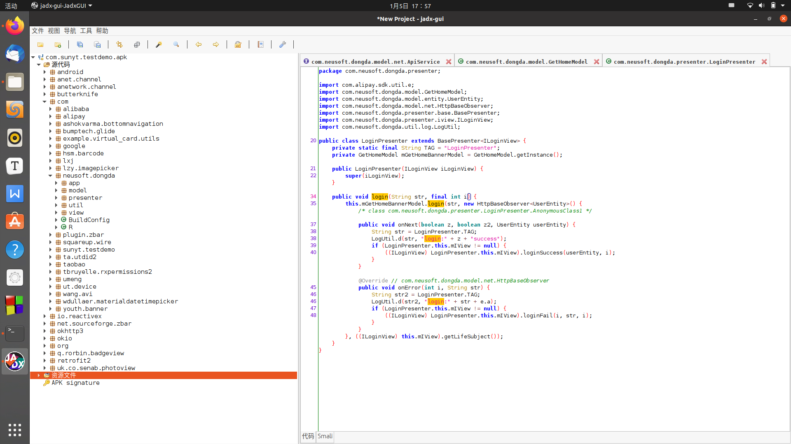

# RE：从零开始的东大健康上报自动化（上）

大家吼啊！这个可能是fangkehou博客的第一篇博文，由于写这篇博文的时候我们的博客站还没有建好，所以我只能现在lab里放一下啦~~~博客建好之后会挪过去的！

那么事情的起因是这样的，我们学校要求整个暑假都要进行健康上报，不上报不能进校园。众所周知，假期是供学生们娱乐玩耍的时间，每天健康上报好麻烦的喂，岂能容忍他人耽误我们的时间？绝对不允许的说！所以我决定针对我们学校的健康上报系统写一个自动上报的脚本，写的不好还请多多关照啦！（-_-#）

对了，这个东西是开源的，毕竟是需要在github action上用的嘛，就在这啦：

[NEU Health Check](https://github.com/zhangke200377/neu_health_check)

觉得我的东西还不错欢迎star哦，感觉有什么需要改进的地方也欢迎发Issue和PR哦！

第一集 App的抓包分析（解决登录问题）

第二集 Web端处理（真正的信息上报流程）

第三集 使用Github Action自动化执行（想看怎么使用的直接看这个就好）

在开始之前我还想说一句：欢迎大家加入放课后的下午茶时间下午茶时间哦！欢迎大家一起闲聊吹水！QQ群号184431788

----

俗话说知己知彼百战不殆，要想写出一个符合校情的程序来，首先我们应该清楚我们需要那些东西。

### 0. 前期分析与准备

健康上报系统的业务流程是先登录，然后会让你填写一个问卷，最后还会获取你的定位然后上报

我们学校健康上报系统的账号接入的是我们学校的SSO（单点登录，学校里叫统一身份认证）平台，但是在接入之后还会维护一个自己的cookie，好像有效时间还蛮久的，不过这不是本文的讨论范围。

我们学校的SSO平台一共支持三种登录方式，微信登录，App登录，网页登录，每种登录方式最后的效果都是一样的，都会给需要登陆的源站返回一个token，所以我们只要挑选适合自己的方式就可以登录了

我们想要挑选不需要重复登录就可以每天上报的方式，所以综合来看还是App的登录方式最适合这个程序（更新：写到后面我才知道，tm手机端根本就tm不需要登录，我们学校客户端的手机登录写的跟坨屎一样，登录直接返回的是用户信息，而且每次使用的时候还在本地计算token，就tm离谱 ---不过也给我这种人留下来绝好的机会就是了。。。。--- ）

### 1.对App联网请求抓包

首先用小黄鸡对学校App的登录抓包，我满心期望能看到几个发送给服务器账号密码（哪怕是加密过的参数）的POST请求，结果并没有我所期待的POST请求，所有的请求都是GET，这就让我摸不到头脑了。。。。。。难道是neusoft或者上几届的大大们在写这个代码的时候用的一些骚操作使得小黄鸡抓不到包？（至于为什么这么说呢，因为阿里系的应用大多数请求都抓不到包，我寻思咱们neusoft都跟BAT齐名成为知名企业了那技术不还得是杠杠的-_-#）（你看看那杭州的阿里，比你们不知道高到那里去了，我和他谈笑风生）但很快我发现了不对劲，我抓到的所有包虽然都是GET请求，但是请求的URL却都是 `mobile/ifs` 这个目录下的，结构都是 `mobile/ifs/[一串没有规律的字符串]` ，这让我感觉有一点希望了。既然如此，这么猜下去也没有什么意义，那我们就从ifs入手吧！

### 2.客户端解包

下载学校App的最新版本，拖入到jadx里进行分析，我兴奋地发现：

__代码居然没有被混淆诶__

既然如此那就给我的分析增添了更多的信心！

接着在代码中查找字符串ifs，发现所有结果都集中在两个类上，因为ApiService这个类名上有API这三个字母所以我先分析了ApiService



这刚一打开这部分源码，我马上就看到了金光闪闪的login函数，这个时候我觉得我自己特别幸福，感觉人生走到了巅峰，我仿佛看到了胜利在向我招手！



但是当我查找这个函数在哪里调用的时候，我特喵无语了。。。。。。。。。





许多个login一层嵌套着一层，当你看到一个login之后说不定调用它的还是个login。。。。。靠

继续一层层的找，最后我来到了Activity类中，可以理解为Android应用程序的各个页面，那么到这之后函数的调用开始分叉了，走到了两个activity中，那么就两个都分析一遍好了


#### 2.1 LoginActivity


分析了LoginActivity之后我发现了登录请求的路径是由 `method=userLogin&id_number=用户名&pwd=密码&mobile_device_uuid=设备标识符&version=App版本` 加密后得到的，也就是说只要弄懂了加密的方法我就可以伪造一个请求登录。参数在加密的时候调用了DESCoderUtils这个函数，这个应该就是最终加密所需要的函数了。

#### 2.2 ZipAppDetailActivity

这里其实没有啥好说的主要就是知道了设备标识符和App版本并不是强制要求的参数（但最后我还是通过随机生成的方式生成了设备标识符放到了参数里）。

也就是说参数可以简化为 `method=userLogin&id_number=用户名&pwd=密码`

#### 2.3 DESCoderUtils

关于DESCoderUtil嘛。。。。。。（查百度）。。。。。害，顾名思义，就是desede/CBC/PKCS5Padding加密方式（其实就是标准DESede）（大花花：不要face）

密匙是 `neusoftneusoftneusoftneusoft`（超过了24位所以只取前24位，也就是 `neusoftneusoftneusoftneu`）

（更新：居然是 `neusofteducationplatform` 两个秘钥一起用，在这个地方卡了好久。。。。。。）

iv是 `01234567`

那么有这两个东西之后我们就可以很简单的构造登录的字符串了

（注：我大胆猜测服务端和android端用的可能是一套加密代码（毕竟javax库Java8之后都可以用），那个main函数看起来特别的突兀。。。。。。）

正当我欣喜的时候，我突然发现下面对返回值的处理竟然就只是明文存储学号密码等等一些信息，并没有存cookie之类的东西，回到小黄鸡看返回的到底是个什么发现居然返回的是一串学生信息的json！到这里就没有其他的路可以走了

于是我再次看了一下抓包结果，我发现了pass.neu.edu.cn的域名，这正好是登录所用到的域名，就和电脑上使用浏览器登录的结果作对比，发现多出了`source` `neusoftapp` `tt` `enp` `idnumber` 几个请求头，再次用代码搜索查找，找到了具体的位置


发现tt是当前时间戳

idnumber是DESede加密后的学号

enp是时间戳与国密3（SM3）加密后的密码拼接之后取MD5之后的第5到28位（至于这个SM3算法是怎么出现的。。。我只能说不混淆就是好，这个类是干啥用的就都在类名上了，这就是好好起名字的好处啊！看到了嘛各位！）

至此所有登录所需要的东西都已经出现了，只需要使用python实现一遍了

### 3.用python实现

DESede和SM3具体实现不会写，写不会写，抄我还不会抄吗（世界顶级CV软件工程师）

```python
import os
import json
import time
import requests
from bs4 import BeautifulSoup
from Crypto.Cipher import DES3
import base64
import binascii
from pysmx.SM3 import digest
import hashlib
import urllib.parse

def getDES3Token(text, key):
    #PKCS5Padding
    #字符串长度需要是8的倍数
    BS = 8
    pad = lambda s: s + (BS - len(s) % BS) * chr(BS - len(s) % BS)
    unpad = lambda s : s[0:-ord(s[-1])]
    #注意3DES的MODE_CBC模式下只有前24位有意义
    #key和iv都需要是bytearray
    #
    
    iv = b'01234567'
    #text也需要encode成bytearray
    plaintext = pad(text).encode()
    #使用MODE_CBC创建cipher
    cipher = DES3.new(key, DES3.MODE_CBC, iv)
    #加密
    result = cipher.encrypt(plaintext)
    result = binascii.b2a_hex(result)
    result = str(result, 'utf-8')
    return result.upper()
    
def getSM3Token(text):
    result = digest(text)
    result = binascii.b2a_hex(result)
    result = str(result, 'utf-8')
    return result
    
def getMD5Token(text):
    return hashlib.md5(text.encode(encoding="UTF-8")).hexdigest().upper()


def login(username, password) -> (int, requests.session):
    s = requests.Session()
    headers = {
        "user-agent": "okhttp/3.8.0"
    }
    login_url = "https://portal.neu.edu.cn/tp_up/up/mobile/ifs/" + getDES3Token("method=userLogin&id_number=" + username + "&pwd=" + password + "&mobile_device_uuid=" + getMD5Token(str(time.time())) + "-Android&version=1.6.5", key = b'neusofteducationplatform')
    f = s.get(login_url, headers=headers)
    f.raise_for_status()
    result = json.loads(f.text)
    if result["success"] == False:
        return -1, s
    return result, s

def get_token(s):
    current_time = str(int(time.time() * 1000))
    headers = {
        "User-Agent":"Mozilla/5.0 (Linux; Android 11; KB2000 Build/RP1A.201005.001; wv) AppleWebKit/537.36 (KHTML, like Gecko) Version/4.0 Chrome/87.0.4280.141 Mobile Safari/537.36",
        "Accept":"text/html,application/xhtml+xml,application/xml;q=0.9,image/webp,image/apng,*/*;q=0.8,application/signed-exchange;v=b3;q=0.9",
        "tt": current_time,
        "neusoftapp": "neusoftAPP",
        "source": "neumobile",
        "idnumber": getDES3Token(str(USERNAME), key = b'neusoftneusoftneusoftneu'),
        "enp": getMD5Token(getSM3Token(str(PASSWORD)) + current_time)[5:28],
        "X-Requested-With": "com.sunyt.testdemo",
        "Referer": "https://apipay.17wanxiao.com/"
    }
    f = s.get("http://e-report.neu.edu.cn/mobile/notes/create", headers=headers)
    f.raise_for_status()
    soup = BeautifulSoup(f.text, 'html.parser')
    if len(soup.select('input[name="_token"]')) != 1:
        return -1
    return soup.select('input[name="_token"]')[0]['value']
    


if __name__ == "__main__":
    if not USERNAME or not PASSWORD or not USER_PROVINCE or not MAP_LAT or not MAP_LON:
        print("参数出错，请无论如何也输入所有参数")
        exit(1)
    print("登录中。。。。")
    user_detail, s = login(USERNAME, PASSWORD)
    if user_detail == -1:
        print("登录失败，请检查用户名和密码")
        exit(0)
    user_name = user_detail["message"]["USER_NAME"]
    print("登陆成功，正在签到。。。。")
    token = get_token(s)
    if token == -1:
        print("未知错误，请联系作者")
        exit(0)
    result = renew(token, s, USERNAME, user_name, USER_PROVINCE, HOME)
    if not result:
        print("未知错误，请联系作者")
        exit(0)
    print("签到成功，感谢使用")
    print('*' * 30)

```

那么到这里我们已经顺利的登录进系统了，那下一步就是结合具体的web响应出相应的对策了

欢迎大家继续看下去哦！


bye~~~